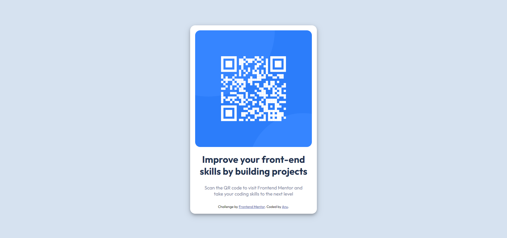

# Frontend Mentor - QR code component solution

This is a solution to the [QR code component challenge on Frontend Mentor](https://www.frontendmentor.io/challenges/qr-code-component-iux_sIO_H). Frontend Mentor challenges help you improve your coding skills by building realistic projects. 

## Table of contents

- [Overview](#overview)
  - [Screenshot](#screenshot)
  - [Links](#links)
- [My process](#my-process)
  - [Built with](#built-with)
  - [What I learned](#what-i-learned)
  - [Useful resources](#useful-resources)
- [Author](#author)

## Overview

### Screenshot



### Links

- Solution URL: [Add solution URL here](https://your-solution-url.com)
- Live Site URL: [Add live site URL here](https://your-live-site-url.com)

## My process

### Built with

- Semantic HTML5 markup
- CSS Flexbox

### What I learned

- How to build a "card" and center it
- Add box-shadow to the container to give it paper-card like effect, as such:

```css
    box-shadow: 0 4px 8px 0 rgba(0, 0, 0, 0.2), 0 6px 20px 0 rgba(0, 0, 0, 0.19);
```

### Useful resources

- [Flexbox Froggy](https://flexboxfroggy.com/) - This game helped me clear my concepts regarding CSS flexbox.

## Author

- Frontend Mentor - [@anu-codes](https://www.frontendmentor.io/profile/anu-codes)
- Twitter - [@anucodes](https://www.twitter.com/anucodes)


